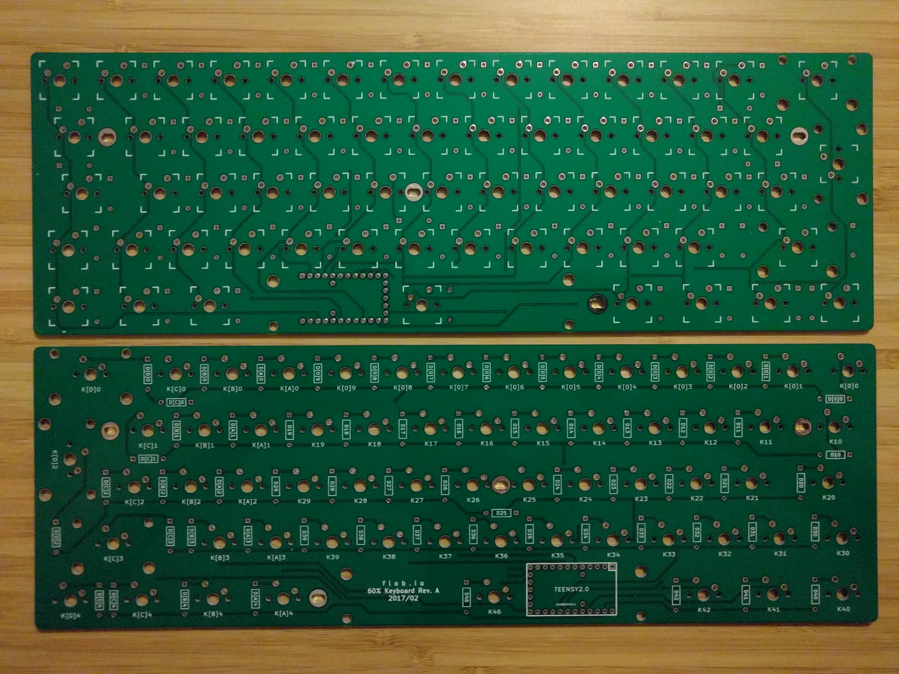

f.60
=========

About
-----

The f.60 is an open hardware 60% mechanical keyboard.

The board has a standard 62 key ISO layout designed for [Cherry MX](https://deskthority.net/wiki/Cherry_MX) switches. To avoid [ghosting](https://deskthority.net/wiki/Rollover,_blocking_and_ghosting#Ghosting) each switch has an associated diode. The [1N4148](https://en.wikipedia.org/wiki/1N4148_signal_diode) is a common choice; however any signal diode should work.

The board is designed for a [Teensy 2.0](https://www.pjrc.com/teensy/index.html) micro controller.

Repository Contents
-------------------
* **/hardware** - The KiCad design files
* **/firmware** - The TMK firmware files

Revisions
---------
* [Rev. A](https://github.com/robertcalvert/f.60/releases/tag/Rev.A)

License Information
-------------------

(c) 2017 Robert Calvert

The hardware is released under [Creative Commons ShareAlike 4.0 International](https://creativecommons.org/licenses/by-sa/4.0/).
The firmware is released under the [GNU General Public License V2](https://www.gnu.org/licenses/gpl-2.0.html) 

Distributed as-is; no warranty is given.